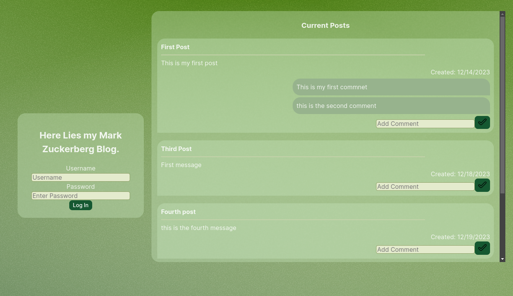

# Blog

### Description

This project is meant to practice working with an express API. I practiced using JWT Tokens as well to practice logging in whenever I feel like blogging on this website. Different permssions are allowed to visitors. A React front end is used to showcase what this backend can do.

### Technologies

This project uses a React frontend using Fetch API calls. It is hosted on Vercel.

The backend is hosted with railway, using express with node. A JWT authentication function is used to provide protection to specific routes. It also uses cors and bcryptjs to provide further security.

A mongoDB Database is used. It provides a space to store users, comments, and posts. It is connected via Mongoose to create CRUD methods with express.
